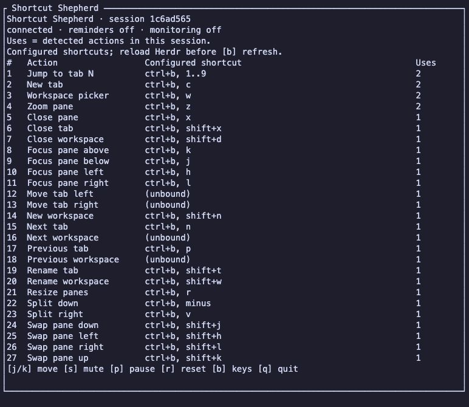
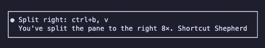
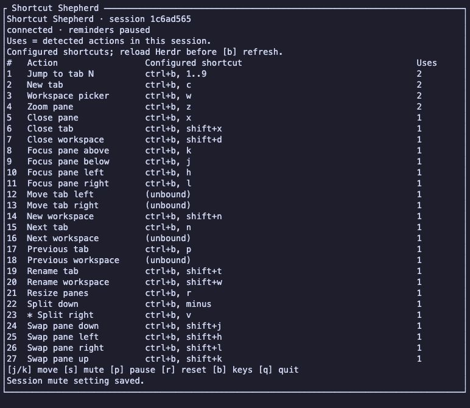

# Shortcut Shepherd

One of the first things my first mentors had me install was [Key Promoter X](https://github.com/halirutan/IntelliJ-Key-Promoter-X) in IntelliJ. It helped me learn the keybindings and build muscle memory as I worked.

I wanted to bring that same experience to [Herdr](https://herdr.dev) as we get used to it here. That's why I built Shortcut Shepherd.

Shortcut Shepherd starts automatically, tracks your tab, pane, and workspace actions, and shows shortcut reminders on macOS.

## Install

Requires Herdr 0.8.0+, Node.js 22.18+, and pnpm 11.25+.

```sh
herdr plugin install roshvan/herdr-plugin-shortcut-shepherd
```

## Use

Open your shortcut stats:

```sh
herdr plugin action invoke roshvan.shortcut-shepherd.stats
```

- **↑/↓** — browse actions
- **s** — mute an action
- **p** — pause or resume reminders
- **q** — close

Reminders are enabled by default for actions with a configured shortcut; unbound actions only appear in stats. Herdr notifications must also be enabled.



*Notification preview*





PRs are welcome!
